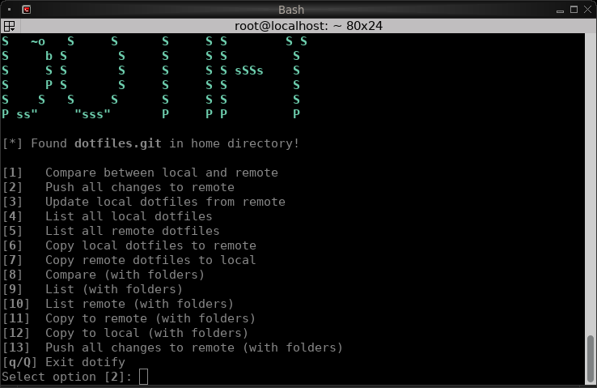

# How to use

Running this script is so easy. Just run the script with no arguments to start the dashboard:

```console
$ dotify
```

If the repo configuration file, `~/.config/dotify.repo`, is not generated yet, it'll present you the prompt where you can enter your own dotfiles repository URL, which this file stores.


If you don't have an existing repository, you can create one. GitHub and GitLab let you create your free Git repository.


***

## Dashboard

<figure><figcaption></figcaption></figure>

The script starts with the option chooser to let you select between these options:



You can perform different operations on dotfiles alone (with no dotfolders). The available options are:

<table><thead><tr><th width="149.6666259765625">Option number</th><th>Description</th></tr></thead><tbody><tr><td>1</td><td>Compare between local dotfiles in your home directory and remote dotfiles repository</td></tr><tr><td>2</td><td>Push all the changes made locally to your remote dotfiles repository</td></tr><tr><td>4</td><td>List all the local dotfiles (home directory)</td></tr><tr><td>5</td><td>List all the remote dotfiles (home directory)</td></tr><tr><td>6</td><td>Copies all the local dotfiles from your home directory to the remote cloned repository</td></tr><tr><td>7</td><td>Copies all the remote dotfiles to the home directory</td></tr></tbody></table>



You can perform different operations on both the dotfiles and the dotfolders. The available options are:

<table><thead><tr><th width="149.6666259765625">Option number</th><th>Description</th></tr></thead><tbody><tr><td>8</td><td>Compare between local dotfiles and dotfolders in your home directory and remote dotfiles repository</td></tr><tr><td>13</td><td>Push all the local changes, including the dotfolders, to your remote dotfiles repository</td></tr><tr><td>9</td><td>List all the local dotfiles and dotfolders (home directory)</td></tr><tr><td>10</td><td>List all the remote dotfiles and dotfolders (home directory)</td></tr><tr><td>11</td><td>Copies all the local dotfiles and the local dotfolders from your home directory to the remote cloned repository</td></tr><tr><td>12</td><td>Copies all the remote dotfiles and the local dotfolders to the home directory</td></tr></tbody></table>



You can also perform other operations below.

<table><thead><tr><th width="149.6666259765625">Option number</th><th>Description</th></tr></thead><tbody><tr><td>3</td><td>Pull all the changes from your dotfiles repository</td></tr><tr><td>q/Q</td><td>Exit the program</td></tr></tbody></table>


